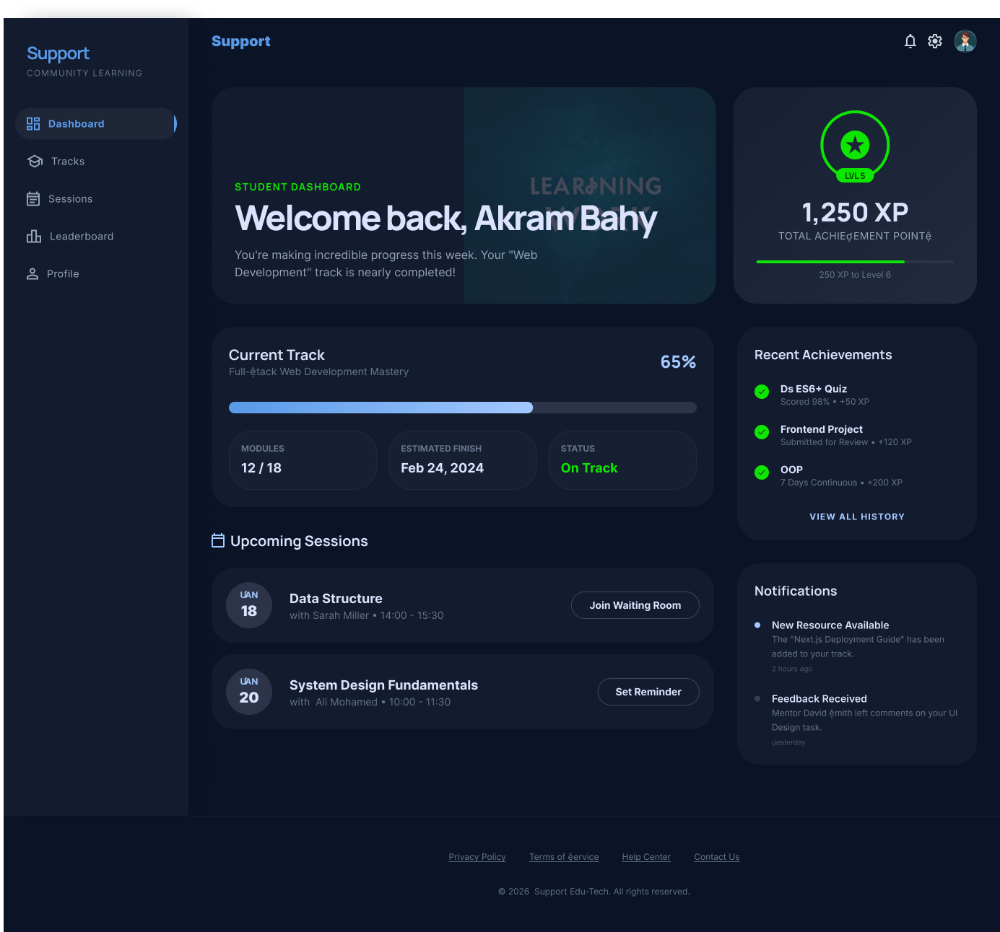
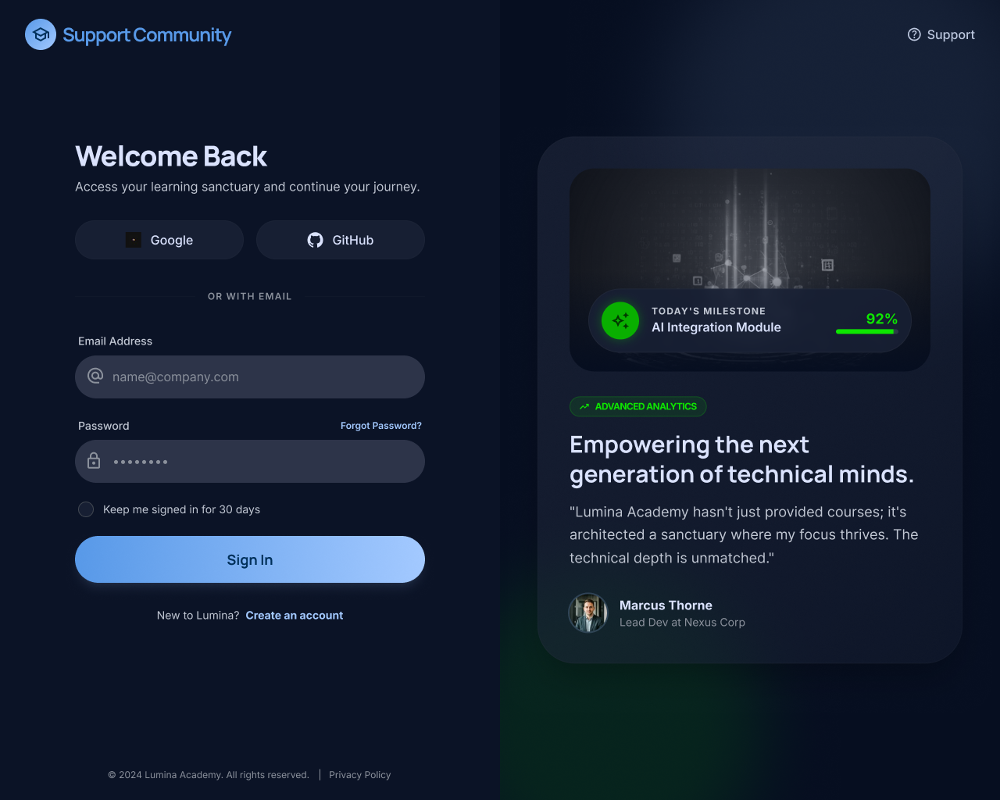
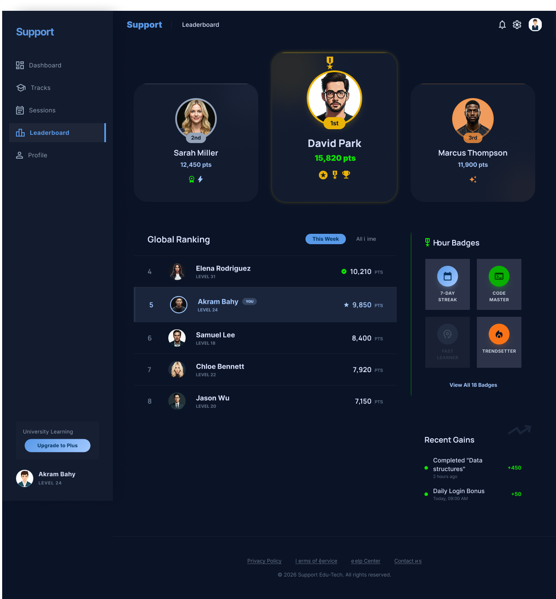

# Support Platform

<p align="center">
  
</p>

<h1 align="center">Support</h1>

<p align="center">
Support is a frontend-based student support system designed as a college project.
It simulates a real learning management platform where students can
</p>

---

##  Overview

**Support** is a frontend web platform created to help students manage their learning journey through a clean and interactive interface.

The platform includes:
- Authentication pages
- Dashboard system
- Session management
- Student profiles
- Leaderboards
- Track selection pages

It is designed with a modern UI/UX approach and can be integrated later with a backend or API services.

---

## ✨ Features

-  Login & Sign Up 
-  Interactive Dashboard
-  Leaderboard System
-  Student Profile Management
-  Session Tracking
-  Track Selection UI
-  Responsive Modern Design

---

## Platform

### Main Page


### Dashboard


### Login


### Student Profile


### Leaderboard


---

##  Tech Stack

- HTML5
- CSS3
- Responsive Web Design

---

##  Project Structure

```bash
Support/
│
├── index.html
├── css/
│   ├── root.css
│   └── style.css
│
├── pages/
│   ├── dashboard.html
│   ├── leaderboard.html
│   ├── login.html
│   ├── profile.html
│   └── session.html
│
├── assets/
│
└── UI/
    ├── Dashboard.png
    ├── Login.png
    ├── Main Page.png
    └── ...
```


